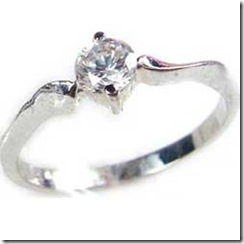

title: 教你10指带戒指真正含义
link: https://lufuhao.wordpress.com/2009/02/21/%e6%95%99%e4%bd%a010%e6%8c%87%e5%b8%a6%e6%88%92%e6%8c%87%e7%9c%9f%e6%ad%a3%e5%90%ab%e4%b9%89/
author: lufuhao
description: 
post_id: 245
created: 2009/02/21 04:47:57
created_gmt: 2009/02/21 04:47:57
comment_status: open
post_name: %e6%95%99%e4%bd%a010%e6%8c%87%e5%b8%a6%e6%88%92%e6%8c%87%e7%9c%9f%e6%ad%a3%e5%90%ab%e4%b9%89
status: publish
post_type: post

# 教你10指带戒指真正含义

###  

###       据说左手的无名指有一根血管直接与心脏联系，所以新人一定要把结婚戒指亲手戴在对方的左手无名指上。 爱你到心里！情愿为你的爱而受戒！戒指戴在不同的手指有不同的意义呀。 

###       右手和左手都有不同的意义。右手小指：不谈恋爱。 右手无名指：热恋中。 右手中指：名花有主。右手食指：单身贵族。 左手小指：不婚族。 左手无名指：结婚。 左手中指：订婚。 左手食指：未婚。大拇指都是代表权势的意思，也可以做自信的意思。

###       戴戒指是有讲究的。按西方的传统习惯来说，左手显示的是上帝赐给你的运气，因此，戒指通常戴在左手上。

###       国际上比较流行的戴法是：食指———想结婚，表示未婚；中指———已经在恋爱中；无名指———表示已经订婚或结婚；小指———表示独身。至于右手，在传统上也有一个手指戴戒指时是有意义的，那就是无名指。据说戴在这里，表示具有修女的心性。

###       还有一种戒指，当你戴它的时候，无论你戴在哪里都不具备任何意义，这种戒指就是一般的花戒。这种戒指是起一种装饰的作用，可以戴在任何你想戴的手指上。戒指戴在拇指上是十分奇怪的，因此不推荐。戒指戴在食指上，感觉是比较有个人主张。最正式的戴法莫过于戴在中指上，如果不想有太正式的感觉，可以在左或右指再加一个简单的指环。无名指上的戒指通常是结婚戒指，无名指长得比较纤细，因此不管什么戒指，戴起来都是标准的秀气。

###       最新鲜的戴法，莫过于把戒指戴在小指头上了。一枚小小的、简单的尾戒让女性的手莫名其妙地可爱起来，一般代表“我现在只想单身，请不要浪费时间追求我”的意思. 戴设计性比较强的戒指时，如果想更有个人风格，可以考虑搭配另一个材质相同、线条较简单的指环在另一指上。如果戒指的材质属性可以和手表搭配，那是最好不过的了。例如你戴的是枚可爱的花戒指，就可以配一只皮质金框的表。如果你并没有太多可以变换的表或戒指时，不妨考虑把戴戒指的手和戴手表的手错开，不要让不协调的两件配饰在同一只手上出现。在同一只手上戴两枚戒指时，色泽要一致，而且一枚戒指复杂时，另一枚一定要简单。

###       此外，最好选择相邻的两只手指，如中指和食指、中指和无名指或无名指和小指，千万不要中间隔着一座“山”。 比较通用的一种说法是： 戴在拇指上表示追（有行动的对对方的追求），戴在食指上表示求（仅限于内心对爱情的渴望），戴中指表示定（正处在恋爱中或已经订婚了），戴在无名指上表示结（已经结婚了），而戴在小指上就表示离（决定单身或离婚了）。在**，不戴戒指也表示“名花还无主，你可以追我”。

###       戒指泄露的心底故事，戒指不仅仅是装饰品，你喜欢戴哪一类戒指，喜欢戴哪根手指，都会泄露你的心底故事。对男士来说——．戴纯银戒指表示性情温和，易迁就他人。 戴金戒指者较重视利益，往往会有精明的生意头脑。 戴翡翠玉石者注重品味素质，处事严谨。 对女士来说—— 喜爱粉红钻或粉红色珊瑚者，感情丰富而浪漫。 喜爱红宝石或红碧玺者，热情似火。 喜爱蓝宝石或海蓝宝者．较内向冷淡。喜爱祖母绿或土耳其石者，情感纤弱。 手指与戒指—— 戒指戴在不同的手指上，能体现与性格有关的心理含义。 喜戴在食指者，性格较偏激倔强。喜戴在右中指者．崇尚中庸的人生观念。 喜戴在左中指者，有责任感，重视家庭。
